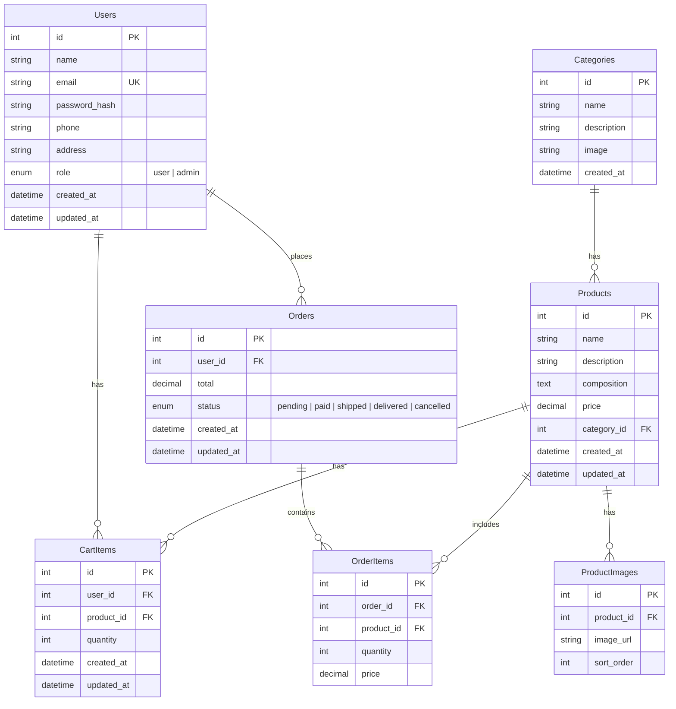
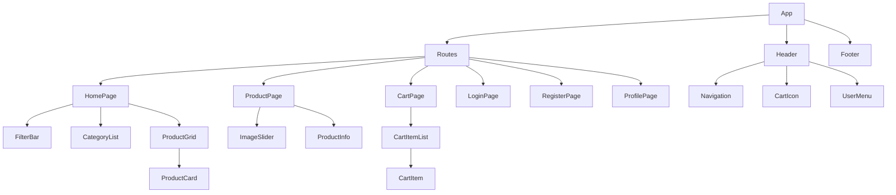
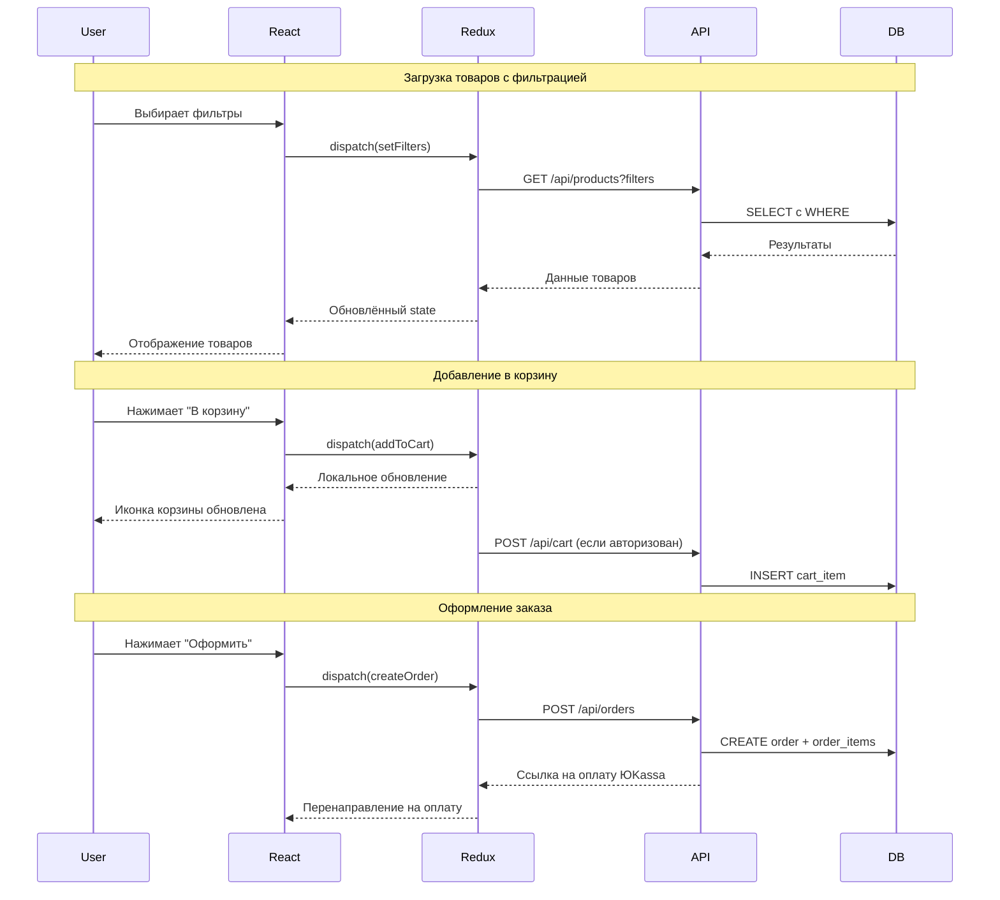

# Архитектура интернет-магазина "МАкси"

## Стек технологий

| Компонент                | Технология                                                                       |
| ------------------------ | -------------------------------------------------------------------------------- |
| **Frontend**             | React 18 + TypeScript + Vite                                                     |
| **State Management**     | Redux Toolkit                                                                    |
| **Routing**              | React Router v6                                                                  |
| **HTTP Client**          | Axios                                                                            |
| **Стилизация**           | CSS Modules                                                                      |
| **Backend**              | Node.js + Express + TypeScript                                                   |
| **ORM**                  | Sequelize                                                                        |
| **БД**                   | PostgreSQL                                                                       |
| **Аутентификация**       | JWT (access + refresh токены), регистрация по email + пароль (без подтверждения) |
| **Загрузка изображений** | Multer                                                                           |
| **Платежи**              | ЮKassa SDK (опционально)                                                         |
| **Сборщик**              | Vite (frontend), tsc (backend)                                                   |

---

## Структура проекта (монорепозиторий)

```
maxi/
├── client/                          # Frontend React
│   ├── public/
│   │   └── images/                  # Статические изображения
│   ├── src/
│   │   ├── api/                     # API-клиенты (axios instance, endpoints)
│   │   │   ├── axiosInstance.ts
│   │   │   ├── authApi.ts
│   │   │   ├── productsApi.ts
│   │   │   ├── categoriesApi.ts
│   │   │   ├── cartApi.ts
│   │   │   └── ordersApi.ts
│   │   ├── components/              # Переиспользуемые компоненты
│   │   │   ├── Header/
│   │   │   ├── Footer/
│   │   │   ├── ProductCard/
│   │   │   ├── ImageSlider/
│   │   │   ├── FilterBar/
│   │   │   ├── CartItem/
│   │   │   └── ProtectedRoute/
│   │   ├── hooks/                   # Кастомные хуки
│   │   │   ├── useAuth.ts
│   │   │   ├── useProducts.ts
│   │   │   └── useCart.ts
│   │   ├── pages/                   # Страницы
│   │   │   ├── HomePage.tsx
│   │   │   ├── ProductPage.tsx
│   │   │   ├── CartPage.tsx
│   │   │   ├── ProfilePage.tsx
│   │   │   ├── LoginPage.tsx
│   │   │   └── RegisterPage.tsx
│   │   ├── store/                   # Redux store
│   │   │   ├── index.ts
│   │   │   ├── authSlice.ts
│   │   │   ├── cartSlice.ts
│   │   │   ├── productsSlice.ts
│   │   │   └── categoriesSlice.ts
│   │   ├── types/                   # TypeScript типы
│   │   │   ├── product.ts
│   │   │   ├── category.ts
│   │   │   ├── user.ts
│   │   │   └── cart.ts
│   │   ├── utils/                   # Утилиты
│   │   ├── App.tsx
│   │   └── main.tsx
│   ├── package.json
│   ├── tsconfig.json
│   └── vite.config.ts
│
├── server/                          # Backend Express
│   ├── src/
│   │   ├── config/                  # Конфигурации
│   │   │   ├── database.ts
│   │   │   └── jwt.ts
│   │   ├── controllers/             # Контроллеры
│   │   │   ├── authController.ts
│   │   │   ├── productController.ts
│   │   │   ├── categoryController.ts
│   │   │   ├── cartController.ts
│   │   │   ├── orderController.ts
│   │   │   └── uploadController.ts
│   │   ├── middleware/              # Middleware
│   │   │   ├── authMiddleware.ts
│   │   │   └── errorMiddleware.ts
│   │   ├── models/                  # Sequelize модели
│   │   │   ├── User.ts
│   │   │   ├── Product.ts
│   │   │   ├── Category.ts
│   │   │   ├── ProductImage.ts
│   │   │   ├── CartItem.ts
│   │   │   ├── Order.ts
│   │   │   └── OrderItem.ts
│   │   ├── routes/                  # Маршруты
│   │   │   ├── authRoutes.ts
│   │   │   ├── productRoutes.ts
│   │   │   ├── categoryRoutes.ts
│   │   │   ├── cartRoutes.ts
│   │   │   └── orderRoutes.ts
│   │   ├── seeders/                 # Сидеры для начальных данных
│   │   ├── types/                   # TypeScript типы
│   │   └── index.ts                 # Точка входа
│   ├── uploads/                     # Загруженные изображения
│   ├── package.json
│   └── tsconfig.json
│
└── package.json                     # Корневой package.json (монорепозиторий)
```

---

## Схема базы данных PostgreSQL



---

## API Endpoints

### Аутентификация

| Метод | Путь                 | Описание                       | Доступ    |
| ----- | -------------------- | ------------------------------ | --------- |
| POST  | `/api/auth/register` | Регистрация                    | Публичный |
| POST  | `/api/auth/login`    | Авторизация                    | Публичный |
| POST  | `/api/auth/logout`   | Выход                          | Публичный |
| GET   | `/api/auth/me`       | Получить текущего пользователя | Приватный |
| PUT   | `/api/auth/profile`  | Обновить профиль               | Приватный |

### Категории

| Метод  | Путь                  | Описание             | Доступ    |
| ------ | --------------------- | -------------------- | --------- |
| GET    | `/api/categories`     | Все категории        | Публичный |
| GET    | `/api/categories/:id` | Категория с товарами | Публичный |
| POST   | `/api/categories`     | Создать категорию    | Админ     |
| PUT    | `/api/categories/:id` | Обновить категорию   | Админ     |
| DELETE | `/api/categories/:id` | Удалить категорию    | Админ     |

### Товары

| Метод  | Путь                | Описание                 | Доступ    |
| ------ | ------------------- | ------------------------ | --------- |
| GET    | `/api/products`     | Все товары (с фильтрами) | Публичный |
| GET    | `/api/products/:id` | Товар по ID              | Публичный |
| POST   | `/api/products`     | Создать товар            | Админ     |
| PUT    | `/api/products/:id` | Обновить товар           | Админ     |
| DELETE | `/api/products/:id` | Удалить товар            | Админ     |

**Фильтры для GET /api/products:**

- `?categoryId=1` — фильтр по категории
- `?minPrice=100&maxPrice=1000` — фильтр по цене
- `?sort=price_asc|price_desc|name` — сортировка
- `?search=текст` — поиск по названию
- `?page=1&limit=12` — пагинация

### Корзина

| Метод  | Путь                | Описание            | Доступ    |
| ------ | ------------------- | ------------------- | --------- |
| GET    | `/api/cart`         | Получить корзину    | Приватный |
| POST   | `/api/cart`         | Добавить товар      | Приватный |
| PUT    | `/api/cart/:itemId` | Изменить количество | Приватный |
| DELETE | `/api/cart/:itemId` | Удалить из корзины  | Приватный |
| DELETE | `/api/cart`         | Очистить корзину    | Приватный |

### Заказы

| Метод | Путь              | Описание                 | Доступ    |
| ----- | ----------------- | ------------------------ | --------- |
| GET   | `/api/orders`     | Заказы пользователя      | Приватный |
| GET   | `/api/orders/:id` | Детали заказа            | Приватный |
| POST  | `/api/orders`     | Создать заказ из корзины | Приватный |

---

## Маршрутизация Frontend (React Router)

```
/                   → HomePage       (категории + товары + фильтры)
/product/:id        → ProductPage    (детальная страница товара)
/cart               → CartPage       (корзина)
/login              → LoginPage      (авторизация)
/register           → RegisterPage   (регистрация)
/profile            → ProfilePage    (профиль, ProtectedRoute)
```

**Защищённые маршруты:**

- `/cart` — доступен без авторизации (корзина хранится в localStorage для гостей и синхронизируется с сервером после входа)
- `/profile` — только для авторизованных пользователей (ProtectedRoute)

---

## Компонентная архитектура Frontend



---

## Поток данных (Data Flow)



---

## Этапы реализации

### Этап 1: Настройка проекта

- Инициализация монорепозитория
- Настройка Vite + React + TypeScript
- Настройка Express + TypeScript
- Настройка ESLint, Prettier

### Этап 2: База данных

- Установка и настройка PostgreSQL
- Создание БД и пользователя
- Написание моделей Sequelize
- Миграции и сидеры (начальные данные)

### Этап 3: Backend API

- Регистрация/авторизация (JWT)
- CRUD категорий
- CRUD товаров + загрузка изображений
- Корзина (CRUD)
- Заказы (создание, просмотр)

### Этап 4: Frontend

- Настройка роутинга
- Страницы регистрации и авторизации
- Главная страница: категории, товары, фильтры
- Страница товара: слайдер, информация
- Корзина
- Профиль пользователя

### Этап 5: Дополнительно

- Интеграция ЮKassa
- Админ-панель (CRUD для товаров/категорий)
- Деплой

---

## Рекомендация по БД

**PostgreSQL** — оптимальный выбор для интернет-магазина:

- Реляционная модель идеально подходит для связанных данных (товары ↔ категории ↔ заказы)
- Транзакции обеспечивают целостность при оформлении заказов
- ACID гарантирует, что данные не потеряются
- Хорошая поддержка JSON полей (например, для хранения характеристик товаров)
- Бесплатный хостинг: Railway.app, Supabase, Render.com

---

## Что дальше?

После утверждения этого плана, я переключу режим на **Code** для начала реализации.
